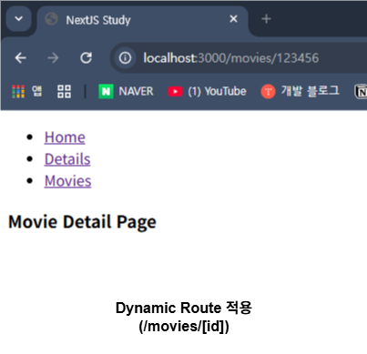
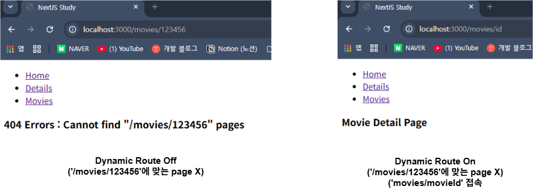
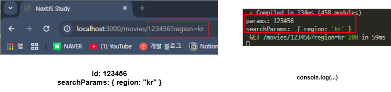

### Dynamic Route (동적 Route)

- `/details`, `/detail/movies`와 같은 static route (정적 route)가 아닌
- `/movie/:movieId`와 같은 형식의 `:movieId (변수)`의 값에 따라 <br/>
	URL이 바뀌는, 동적인 형태를 띄는 Route이다.

- `react-router`로 구현해봤던 Dynamic Route
- `NextJS`에서 구현하려면 파일 시스템을 이용해야 한다.

---

- `movies`라는 이름의 Route Group을 하나 만들고
- 해당 그룹 내부에 `/movies` 폴더를 하나 추가한다.

- 그리고, `/[id]`라는 이름의 폴더를 또 추가하고
- 해당 폴더 내부에 `page.tsx` 파일을 만들어두자.

``` plainText
/app
└ /(movies)
	└ /movies
		└ /[id]
			└ page.tsx
```

- 여기서 `[id]`는 변수, 동적인 값을 받는 `Route`가 된다.
- `[] (중괄호)` 내부에 존재하는 `id`가 변수로서 기능을 한다고 보면 된다.
- 이를 통해서 `React-router`에서 했던 것처럼 동적 Route 구현할 수 있다.

- 물론 `id`를 `[ 중괄호 ]` 감싸주지 않으면 변수로서 기능을 하지 못하게 된다.



- `/movies/[id]` URL의 변수 `id`의 임의의 값을 집어넣어도
- 문제 없이 `/[id]`의 `page`가 출력되는 것을 확인할 수 있다.

- 반대로 `id`를 중괄호로 묶지 않은 상태에서 접속을 시도하면
- `not found page`가 나오는 것을 확인할 수 있다.



---

### Dynamic Route, `/[id]` 값 확인하기

- 이제 `id`에 전달된 값을 console 통해서 확인해보자.

- 강의에서는 이런 식으로 코드를 작성했지만 
- 2025년 9월 기준으로 Dynamic Route 사용하려면 비동기 처리가 필요하다고 해서 <br/>
	강의 페이지의 다른 수강생 분이 올려둔 솔루션을 참고해서 <br/>
	코드를 다음과 같이 작성하였다.

``` tsx
//강의 촬영 당시, Dynamic Route Props 사용법
export default function MovieDetailPage({props}){
	console.log(props);
	//강의 촬영 당시에는 'Dynamic Routing' 처리할 때
	//비동기로 처리하지는 않은 듯 하다..
	//현재와는 많이 달라서 좀 헤맸다.
	return (
		<div>
			<h4>Movie Detail Page</h4>
		</div>
	);
};
```

``` tsx
//다른 수강생 분의 솔루션 참고해서 코드 수정한 버전
export default async function MovieDetailPage({params, searchParams}){
	const {id} = await params;
	const searchs = await searchParams;
	
	console.log(`params: ${id}`);
	console.log("searchParams: ", searchs);
	
	return (
		<div>
			<h4>Movie Detail Page</h4>
		</div>
	);
};
```



