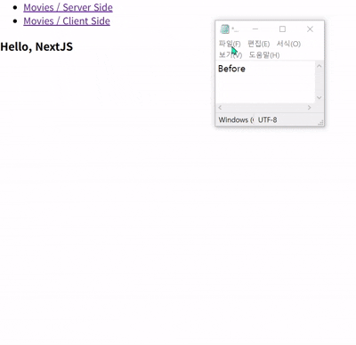

### 이전 내용, 복습

- 앞에서 `Server Components`에서 데이터를 Fetch하는 방법을 알았다.

- 기존 방식, CSR일 때는 페이지가 먼저 나오지만 <br/>
	`Frontend`에서 API 데이터 Fetch 진행하기 때문에 <br/>
	`Movie Data`가 바로 Rendering되지 않는다.

- 물론 아무것도 없는 빈 화면을 사용자에게 보여줄 수는 없기 때문에
- 웹 페이지 화면 상에 데이터를 가져오고 있다는 문구나 <br/>
	Animation 등을 띄워서 사용자에게 빈 화면을 보여주지 않는다.

- 그리고 이번에 배운 SSR 방식에서는
- `Front`가 아니라 `Backend`에서 데이터를 `fetch`하기 때문에 <br/>
	페이지에 접속하는데 걸리는 속도가 CSR보다는 느린 편이다.

- 이러한 단점은 `Loading Component` 추가하는 것으로
- `Backend`에서 `Movie Data`를 Fetch하기 전까지 <br/>
	페이지에 접속할 수 없던 문제점을 개선할 수 있다.

---

### Loading Component

- `/movies`에 `loading.tsx` 파일을 추가하고
- 아래와 같이 코드를 작성하였다.

``` tsx
//Loading Components

export default function Loading(){
	return (
		<div>
			<h4>Movie Data 가져오는 중...</h4>
		</div>
	);
};
```

- 이제 다시 `/movies` 페이지에 접속하면
- Delay 없이 바로 접속이 되는 것을 확인할 수 있다.



- `/movies` 페이지에 접속하면, `Next`는 먼저 브라우저한테
- 해당 페이지의 `<layout />`과 `<loading />`을 먼저 전달하여
- Backend에서 Data Fetch가 완료될 때까지의 시간을 벌고

- `Data Fetch`가 완료되면 해당 결과 값이 있는 Component
- 브라우저에게 전달하고, 브라우저는 해당 Component와 <br/>
	`<loading />`를 교체한다.

- 여기서 `MoviesPage`를 `async`, 비동기로 설정해놔야
- `Backend`에서 Data Fetch가 진행되는 동안
- 미리 준비된, 나머지 `/movies` 페이지를 구성하는 여러 요소들을 <br/>
	사용자에게 전달할 수 있다.

---

