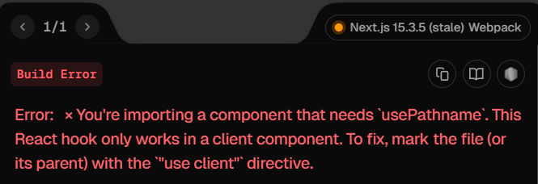

### Navigation Bar 생성 및 Import

- `NotFound` page라는 것이 존재한다는 건 알았으니
- 이제 내비게이션 바를 만들어보자.
- 프로젝트 최상단으로 넘어와서 (`/app` 아님)
- `/components` 폴더를 하나 만들고, 해당 폴더 내부에 `Navigation.tsx` 파일을 추가한다.

``` tsx
export default function Navigation(){
	return (
		<div>
			<ul>
				<li>Home</li>
				<li>Details</li>
			</ul>
		</div>
	);
}
```

- `React-router`에서 페이지 간 이동을 구현할 때 `<a>`가 아니라
- `<Link>` 요소를 통해 페이지 간 이동을 구현했던 것처럼
- `NextJS`에서도 이러한 기능을 가진 컴포넌트가 존재한다. 

- `NextJS`의 `<Link>` 컴포넌트를 import하고 아래와 같이 `<li>`에 추가한다.

``` tsx
import {Link} from "next/link";

export default function Navigation(){
	return (
		<div>
			<ul>
				<li>
					<Link href="/">Home</Link>
				</li>
				<li>
					<Link href="/details">Details</Link>
				</li>
			</ul>
		</div>
	);
}
```

- 이렇게 만든 내비게이션 바를 `Home`과 `Details`의 `page.tsx`에 import하면
- 내비게이션 바가 추가되는 것을 확인할 수 있을 것이다.

- 물론 `/app`의 `layout.tsx`에 해당 내비게이션 바를 import해도 된다.
- `layout.tsx` 파일은 모든 페이지에 공통적으로 적용되는 Component로
- 해당 파일에서 `<Navigation />`를 import하면 모든 페이지에 공통적으로 적용된다.
	(
	메이플 To Do 작업하면서, 카테고리 별 To Do Item에서 공통적인 부분만
	추출해서 `<BasedToDo />`라는 공용 컴포넌트를 만들었던 경험에서 유추한 방식
	)

---

### Navigation Bar Part 2 (현재 위치 표시 추가)

- 덤으로 사용자가 현재 위치가 어디인지를 확인할 수 있는 기능을
- 내비게이션 바에 추가해보자.
- `react-router`를 사용할 때, 현재 사용자가 어느 페이지에 있는 지를 
- 알려주기 위해서 `useMatch()` Hook을 사용했던 적이 있었다.

- 이처럼 `NextJS`에도 이러한 기능을 하는 Hook이 존재한다.
- `usePathName` Hook을 import하고 아래와 같이 코드를 업데이트

``` tsx
//"use client"

import {Link} from "next/link";
import { usePathname } from "next/navigation";

export default function Navigation(){
	const PathName = usePathName();
	
	return (
		<div>
			<ul>
				<li>
					<Link href="/">Home</Link>
					{PathName === "/" ? "👈" : null}
				</li>
				<li>
					<Link href="/details">Details</Link>
					{PathName === "/details" ? "👈" : null}
				</li>
			</ul>
		</div>
	);
}
```

- 코드를 실행해보면 아래와 같은 에러 메시지가 화면에 출력된다.



- 요는 `usePathName` Hook은 `client Component`에서만 사용할 수 있다는 거다.
- 이는 `Navigation.tsx` 파일 최상단에 `"use client"` 추가해서 해결할 수 있다.
- `"use client"`라는 문구만 추가했는데 어떻게 문제가 해결됐을까?

---
