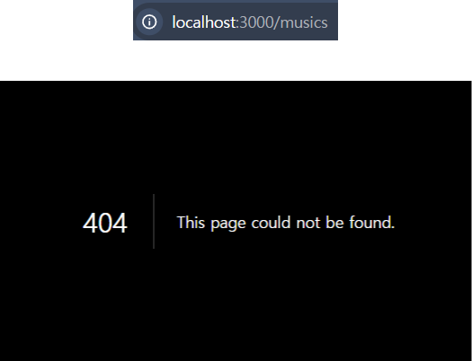
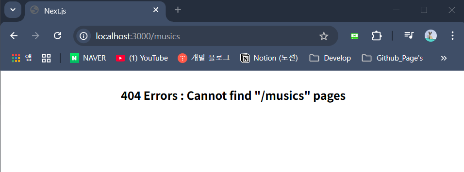

### 개요

- 설명을 위해서 아래와 같이 상황을 가정한다.

``` plainText
- Local 환경에서 NextJS 프로젝트 실행 중
- '/'(Home), '/movies'라는 하위 페이지를 가지고 있음.
- Home, movies 외의 다른 URL 입력해서 해당 페이지로 접속 시도함.
  ('/musics' 페이지로 접속을 시도한다고 가정)
```

- `/musics` 페이지는 정의하지 않았기에 404 에러가 나온다.



- 사용자가 입력한 URL에 대응하는 페이지가 없는 경우
- 즉, 없는 URL로 접속 시에 사용자한테 보여주는 페이지이다.

- `NextJS`는 기본적으로 `Not Found` 페이지를 제공하는데
- 해당 Component 통해서 사용자에게 보여줄 404 Error 페이지를 <br/>
	원하는 형태로 수정하는 것이 가능하다.

---

### `Not Found` 페이지 생성

- `NextJS` Project의 모든 페이지가 들어가있는
- 최상위 폴더인 `/app`에 `not-found.tsx` 파일을 만들고 아래와 같이 설정하였다.

``` tsx
"use client";

import {pathNm} from "next/navigation";

export default function NotFound(){
	const pathNm = usePathName();
	return (
		<div>
			<h4>404 Error: cannot find "{pathNm}" pages</h4>
		</div>
	);
}
```



- 이 글을 쓰는 시점에선 아직 `NextJS`에 대한 이해도가 높지 않기 때문에
- 추가 설명 없이 넘어가도록 하겠다.

---

