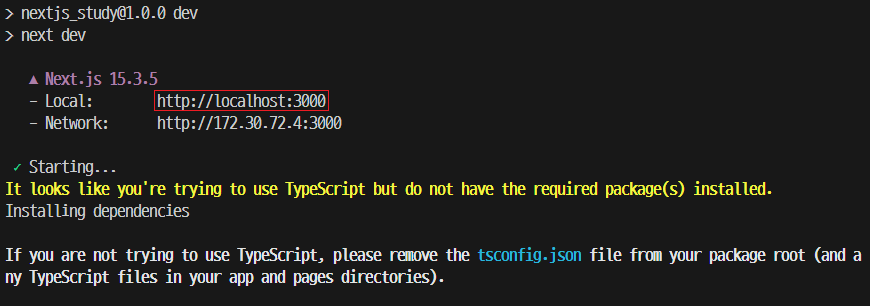
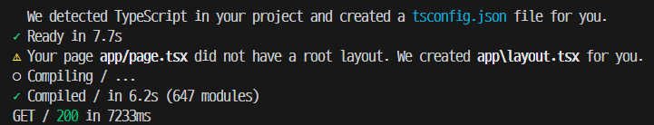

### `Nextjs` 수동 설치

- `Nextjs` 수동 설치를 하기 전에 임의의 폴더 하나를 만든다.
- `/Nextjs_study(임시 명)` 폴더를 만들었다면
- 해당 폴더로 들어간 뒤, 아래 명령어를 입력해서 `package.json`파일을 생성한다.

``` shell
npm init
```

- 그 다음은 `react`, `react-dom`, `next`, 총 3개의 패키지를 설치해준다.

``` shell
npm install react@latest, react-dom@latest, next@latest
#'@latest'는 최신 버전을 설치하는 명령어
```

- 설치된 패키지의 목록과 버전은 `package.json`에서
- `"dependencies": {...}`에서 확인하면 된다.

- `react, react-dom, next`가 설치된 것을 확인했다면
- `"script": {...}`에서 아래 명령어들을 추가해주자.

``` js
"scripts": {
	"dev": "next dev"
},
```

- `dev` 명령어를 실행하면 다음과 같은 일이 발생한다.

``` plainText
1. 'npm run dev' 실행, NextJS가 실행된다.
2. NextJS는 개발자가 작성한 코드를 찾고 (명령어를 입력한 대상)
	(
		NextJS는 사용자가 프레임워크를 호출하는게 아닌
		프레임워크가 코드를 호출하는 프레임워크이다.
	)
3. NextJS는 '/app' 내부에 존재하는 'page.jsx/page.tsx' 파일을 찾아서 실행한다.
4. NextJS가 page.jsx 파일을 실행시킬때는 그대로 실행되지만
	page가 tsx이고, 프로젝트에 TypeScript가 설치가 안된 상태라면
	NextJS가 알아서 TypeScript를 설치하고 이를 실행해준다.
```

- 이제 아래와 같이 `page` Component를 작성하고
	(`index.tsx`, `app.tsx`는 없어도 실행된다.)
- Terminal에 `npm run dev` 입력해서 NextJS를 실행해보자.

``` tsx
export default function page(){
	return (
		<div>
			<h3>Hello, NextJS</h3>
		</div>
	);
}
```

- `React`만 쓰던 시절에는 `npm start`를 입력하면
- 자동으로 `localhost` 페이지가 나왔지만
- `npm run dev`를 입력했을 때는 그렇지 않기 때문에

- 직접 `Terminal`에 나온 URL을 브라우저에 입력해서
- `localhost` 페이지로 이동해야 한다.



- `localhost` 페이지에 접속하는데 성공했다면 
	Terminal에 아래와 같은 명령어가 출력되는 것을 확인할 수 있다.



- 해석해보자면 `/app` 내부에 `root layout`이 없기 때문에
- `NextJS`에서  자동으로 `layout.tsx` 파일을 만들었다는 말이다.

- 그러면 여기서 `root layout`이란 무엇일까?

---

### `layout.js`

- 페이지 간 공유되는 UI
- 여러 페이지 (`page.js`)들에 공통적으로 적용되는 UI를 정의해둔 컴포넌트
- 하위 `page.js`, `layout.js`를 자식으로 감싸서 화면을 랜더링한다.

#### Root Layout

- `Next` 프로젝트 생성 시, `/app` 폴더 내부에 생성되는 `layout.js` 파일
- 최상위 `layout.js` 파일로 모든 `route` 경로, `page`에 적용된다.
- `/app`의 최상위 레이아웃이기 때문에 `<html>`, `<body>`를 반드시 포함해야함.

- `/app` 폴더 내부에 존재하는 모든 폴더, 그 안에서 정의된 <br/>
	`page.js`, `layout.js` 컴포넌트들은 Root layout의 자식으로써 <br/>
	랜더링이 된다는 것을 의미한다.
- React Project의 `index.jsx / index.tsx`와 비슷한 역할을 한다고 이해함.

---


