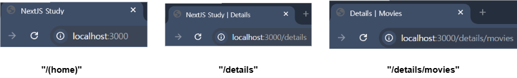

## `metadata`

```
사전적 정의
- 다른 데이터를 정의하고 기술하는 데이터
- 다양한 형식의 다른 데이터의 내용 혹은 구조를 설명하는 데이터
```

- 웹 페이지의 데이터를 설명하는 데이터로서 <br/>
	웹 사이트의 검색 엔진 최적화 (SEO)와 공유성 향상에 중요한 역할을 수행함

- `html`의 `<head>` 부분에 위치한 `<meta>`, `<link>` 태그를 통해 정의됨

``` ts
//root layout (/app/layout.tsx) 파일에서 정의된 metadata
export const metadata = {
	/* before
	title: 'Next.js',
	description: 'Generated by Next.js',
	*/
	title: "NextJS Study",
	description: "NextJS 프레임워크 학습용 예제입니다."
};
```

``` html
<!-- Next App에서의 metadata 설정, 출력 부분-->
<head>
	<!-- before
	<title>Next.js</title>
	<meta name="description" content="Generated by Next.js">
	-->
	<!-- After -->
	<title>NextJS Study</title>
	<meta name="description" content="NextJS 프레임워크 학습용 예제입니다.">
</head>
```

- `metadata` 객체의 `title, description`등의 값을 임의의 값으로 수정
- 현재 실행 중인 `Next App`의 `head`에도 똑같이 반영된다.

- 이러한 `metadata`는 `layout`처럼 중첩이 가능하다. <br/>
	(정확히 말하자면 병합에 더 가까움...)

- `metadata`는 서버 컴포넌트에서만 존재할 수 있으며
* 클라이언트 컴포넌트에서는 `metadata` 내보낼 수 없다. <br/>

---

- `metadata`는 아래와 같이 `template` 추가할 수 있다.

``` tsx
import {Metadata} from "next";

//root layout, metadata
export const metadata: Metadata = {
	title: {
		template: "NextJS | %s",
		default: "NextJS Study"
	},
	description: "NextJS 프레임워크 학습용 예제입니다."
}

//Details layout, metadata
export const metadata = {
	title: {
		template: "Details | %s",
		default: "Details"
	}
};

//Movies layout, metadata
export const metadata = {
	title: "Movies"
};
```





- 중간 Route인 `details`의 `metadata`를 정의해뒀기 때문에
- `details`의 `nested route`인 `movies`에는 
- `root layout`의 `metadata, title template`이 전달되지 않는다.

- `NextJS`의 `metadata` 병합할 때에는 
- 가장 가까운 `layout, page`의 `metadata`가 우선적으로 적용되기 때문이다.

- `movies` 입장에서는 가장 가까운 `metadata`는 `details`의 `layout`이므로 <br/>
	최상위 레이아웃인 `root layout`의 `title` 정보가 <br/>
	제일 가까운 레이아웃, `details layout`의 `title` 덮어 씌워진다.

- 그렇기 때문에 `Movies`에는 `root layout`의 `title template`이
- 적용되지 않는 것이다.

---

