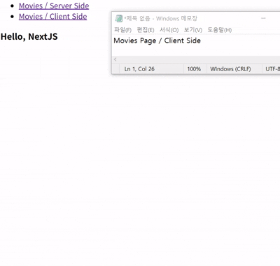

- `NextJS`에서 데이터 Fetch하는 방법에 대해 알아보자.
- 비교를 위해서, 기존 방식 (React에서 쓰던 방식 / Client Side)과 <br/>
	새로운 방식 (`NextJS` 버전 / Server Side) 두 가지 버전을 준비해봤다.

- 현재 수강 중인 강의에서 제공한 API 사용했다. <br/>
- **[`Nomadcoders - NextJS 시작하기`](https://nomadcoders.co/nextjs-for-beginners)**

---

### Client Side

- `@tanstack/react-query`와 같은 외부 라이브러리는 사용하지 않음.
- `useState`, `useEffect`와 같은 React Hook 활용해서 Data Fetch

``` tsx
"use client"

import {useState, useEffect} from "react";

interface I_Movies {
	"adult": boolean;
	"backdrop_path": string;
	"genre_ids": number[];
	"id": number;
	"original_language": string;
	"original_title": string;
	"overview": string;
	"popularity": number;
	"poster_path": string;
	"release_date": string;
	"title": string;
	"video": false;
	"vote_average": number;
	"vote_count": number;
};

export default function MoviesPage(){
	const [isLoading, setLoading] = useState(true);
	const [Movies, setMovies] = useState<I_Movies[]>([]);
	
	const GetMovieData = async() => {
		const MovieData = await(await(
			await fetch("https://nomad-movies.nomadcoders.workers.dev/movies")
		).json());
		
		setMovies(MovieData);
		setLoading(false);
	};
	
	useEffect(() => {
		GetMovieData();
	}, []);
	
	return (
		<div>
			<h4>Movie's Data</h4>
			{
				isLoading ? "Loading..."
				: (
					<ul>
						{
							Movies?.map((movieData) => {
								return (
									<li key={movieData.id}>
										{movieData.title}
									</li>
								);
							})
						}
					</ul>
				)
			}
		</div>
	);
}
```

- Fetch는 항상 Client 측에서 진행된다. (브라우저가 API에 요청을 보내는 것)
- 이러한 방식은 API 키가 노출될 수도 있다는 문제점이 존재한다. <br/>
	개발자 콘솔의 `Network`로 들어가면 확인할 수 있다. <br/>
	예전에 개발했던 프로젝트 들어가서 확인해보니 진짜로 API Key 확인할 수 있었다.

- 보안 상의 이유로 DB와 통신하기도 어려워진다.

- 그리고 결국은 Client 측에서 Fetch 진행하기 때문에
- 사용자에게 데이터를 가져오고 있다는 걸 알려주기 위해서
- 화면에 `Loading` 상태를 출력해야 하기도 한다.

- 데이터를 가져오기 전까지는 사실상 빈 화면이기 때문이다.
- 이러한 방식은 Server Components에선 사용할 수 없다고 한다.

- 그러므로 이제 Server Components에서 Data Fetch하는 방법을 알아야 한다.

---

### Server Side

- 기존 코드에서 API URL만 제외하고 전부 지우고
- 아래와 같이 새로 코드를 작성하였다.

- Server side에서 Movie Data를 Fetch하는 코드이다.

``` tsx
interface I_MovieData {
	/*Type 생략*/
}
const GetMovieData = async() => {
	const API_URL = "https://nomad-movies.nomadcoders.workers.dev/movies";
	const MovieData = await(await(
		await fetch(API_URL)
	).json());
	
	return MovieData;
};

export default async function MoviesPage(){
	const Movies = await GetMovieData();
	
	return (
		<div>
			<h4>Movie's Data</h4>
			<ul>
				{
					Movies.map((data) => {
						return <li key={data.id}>{data.title}</li>
					})
				}
			</ul>
		</div>
	);
};
```

- `Movies Page`가 랜더링 되는 것을 `Client Side`, `Server Side`
- 아래 이미지를 통해서 확인해보자.



- `Movies / Client Side` 페이지는 URL 클릭 시 바로 접속은 되는데
- Movie Data가 바로는 안나오고, `Loading...`이라고 적힌 문구가 나온다.

- 이제 `Movies / Server Side` 페이지를 확인해보자.
- URL 클릭하면, 페이지 접속까지 약간의 Delay가 있지만
- 페이지에 접속하면, 바로 Movie Data가 출력되는 것을 확인할 수 있다.

- `Movies / Server Side`의 `Page.tsx`는 서버 컴포넌트로
- `NextJS`가 `fetch`된 URL을 자동적으로 Caching 하기 때문에 <br/>
	별도의 로딩 state나 이런게 필요하지 않는 것 같다.

``` plainText
Caching / 캐싱
- 자주 사용되거나, 검색 비용이 높은 데이터를 
  더 빠른 위치(Cache)에 임시로 저장하여
- 이후 데이터 접근 시 원본 저장소에 직접 접근하는 대신
  캐시에서 데이터를 빠르게 가져와 성능을 향상시키는 기술

* 작동 방식
- 사용자가 데이터를 요청하면, 시스템은 먼저 Cache에 해당 데이터의 유무를 확인
- Cache에 데이터가 존재하면, 원본 저장소를 거치지 않고
  Cache에서 데이터를 즉시 가져와서 응답(response)한다.
- Cache에 데이터가 없을 경우, 원본 저장소 (DB, 원격 서버,...)에서
  데이터를 가져온다.
- 가져온 데이터는 Cache에 저장해두고, 추후 같은 요청이 있는 경우
  더 빠르게 응답하는 것이 가능하다.
```

- 개발자 콘솔의 `Network` 탭에서 두 버전의 log 비교해봤는데

- `Client` 쪽은 처음 접속 시, 페이지를 새로고침 할 때 <br/>
	두 케이스 모두 `fetch`가 발생되는 것을 확인하였다.

- 반대로 `Server` 쪽은 처음 접속할 때는 `fetch`를 하지만 <br/>
	새로고침을 할 때 log를 살펴보면 `fetch`가 발생되지 않았다.

- 처음에 가져온 `Movie Data`, Cache에 저장해뒀기에 <br/>
	새로고침을 해도, 다시 서버에 데이터를 요청할 필요 없이 <br/>
	Cache에 저장된 데이터를 가져오면 되기에 `fetch`가 발생되지 않는 것 같다.

- 즉, `Client Component`는 `Front`에서 데이터를 `Fetch`하고 <br/>
	`Server Component`는 `Back`에서 데이터를 `Fetch`한다.

- 그렇기 때문에 초기 로딩 속도는 `Server Components`가 느린 것 같다.
- `Backend` 영역에서 `Movie Data`를 `Fetch`하기 때문에 <br/>
	이런 차이가 발생하는 걸로 보인다.

---

