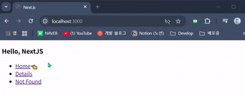
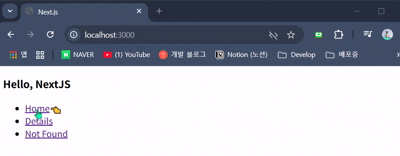

- 이전 챕터, `CSR vs SSR` 정리는 필기 노트에 작성해뒀음

### Hydration

- Server Side Rendering (SSR) 통해 만들어진 
- 정적인 HTML, 페이지를 Client 측 Javascript 사용하여
- 동적인 React Component 변환하는 과정
- 서버 환경에서 이미 Render된 HTML에 React 붙이는 것
- 단순 HTML을 React App으로 초기화하는 작업

---

- 개발자 도구에서 `JavaScript` 비활성화로 설정해두고
- `Next App` 실행해보면 활성화 / 비활성화 상태의 차이가 보일 것이다.

- `<a>` 요소를 통해 페이지 간 이동을 하는데
- `JavaScript`가 비활성화 상태일 때는 이동할 때 새로고침이 발생한다.
- 그리고 `JavaScript`가 활성된 상태에서는 페이지 간 이동 시  
	새로고침이 발생하지 않는 것을 확인할 수 있다.

- `Javascript`가 비활성화 상태일 때

- `Javascript`가 활성화 상태일 때

---

- 처음에 웹 페이지가 랜더링될 때, 초기 HTML 파일이 먼저 전달되고
- 이후에 HTML 요소들을 React Component 변환한다.

- 즉, 저기서 Event가 발생하면, 자동으로 React가 끼어들어서
- 웹 페이지 전체를 Re-render하지 않고 필요한 부분만 업데이트를 한다.
- 물론 `Javascript`가 비활성화 상태라면 React가 끼어들지 않고

- 단순한 HTML로 남아있을 뿐이다.

